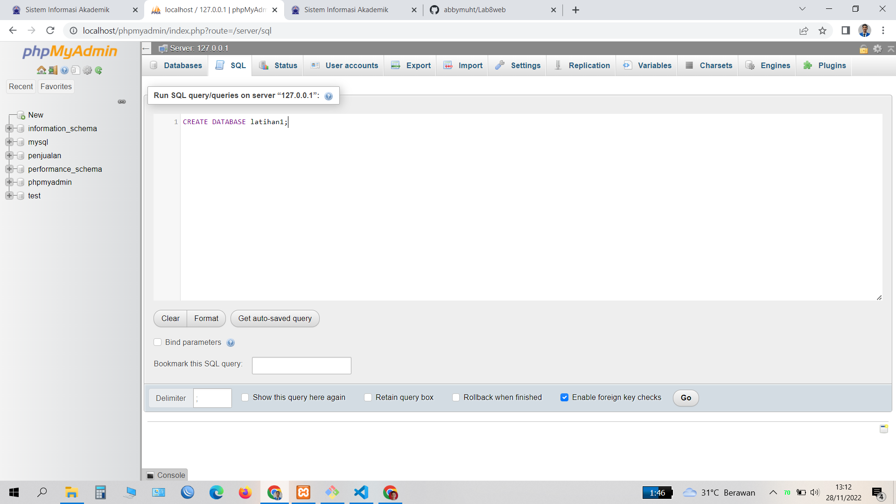
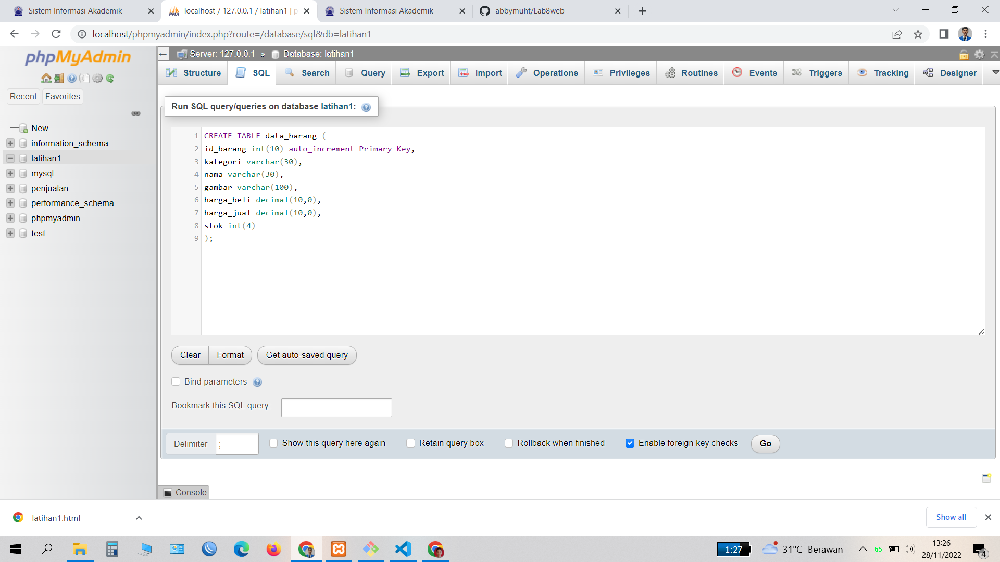
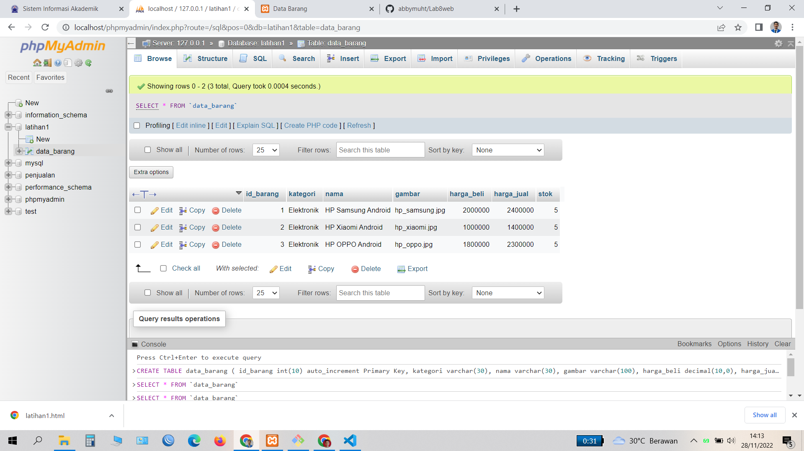
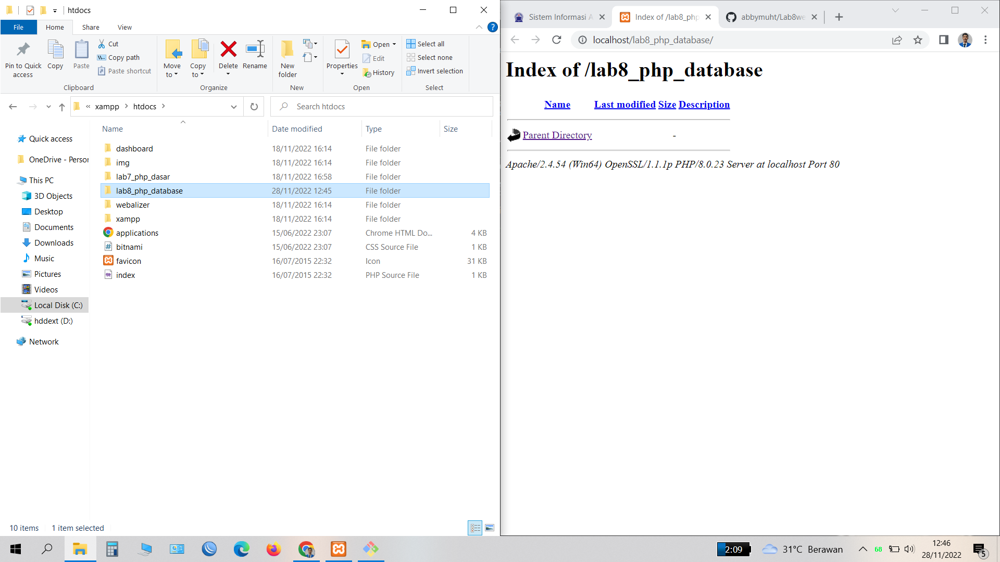
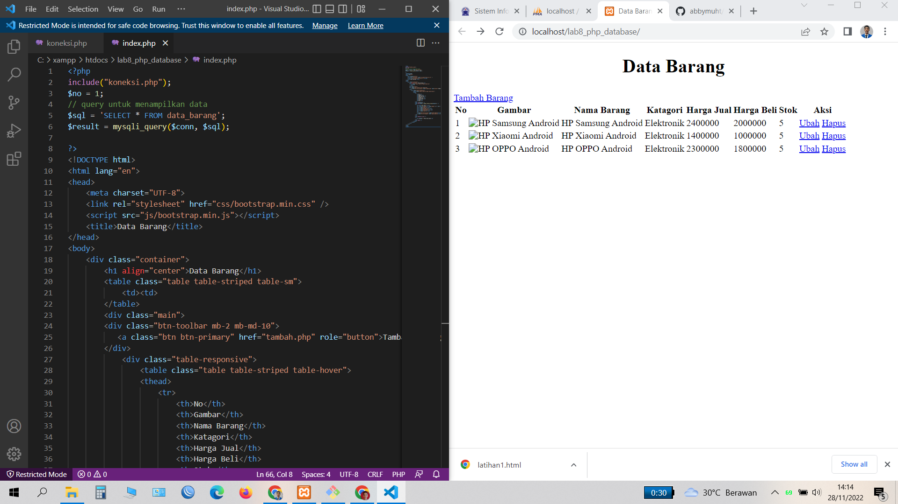
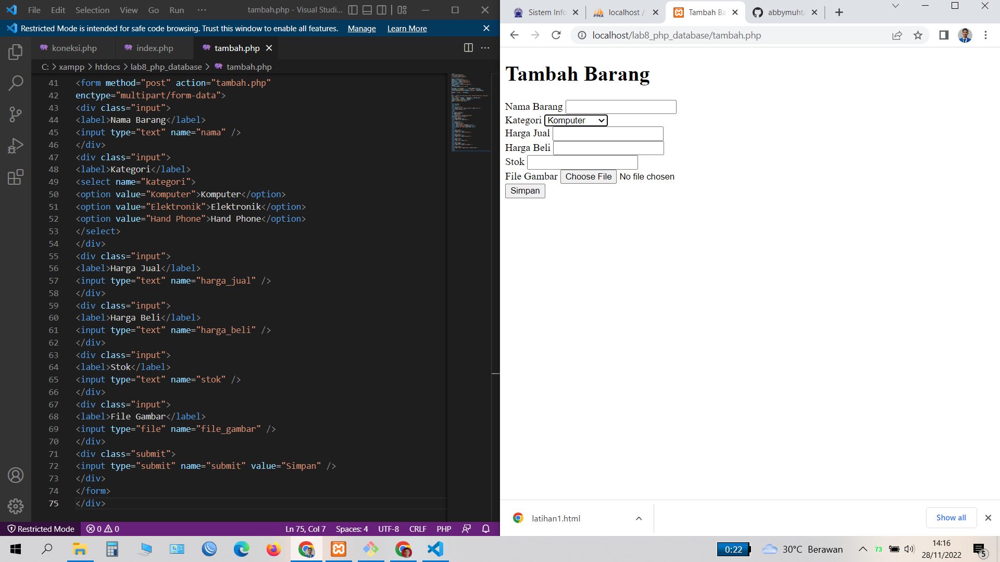
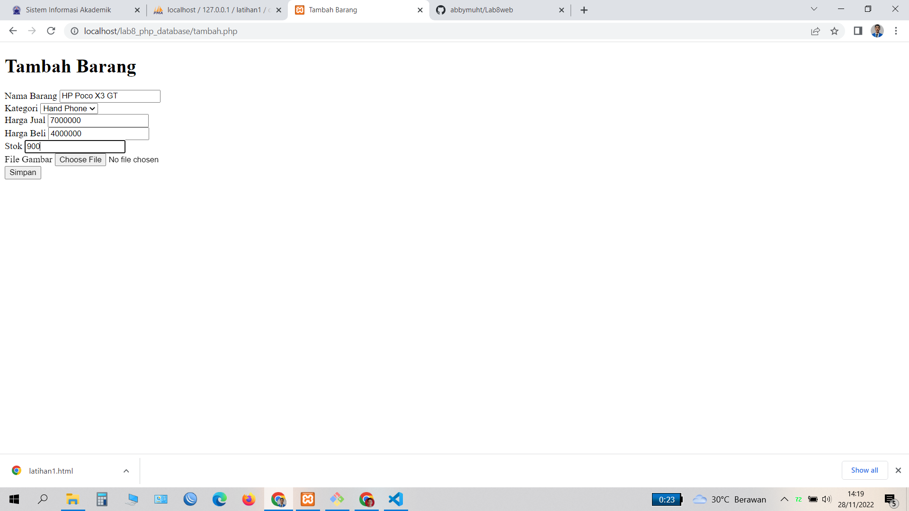
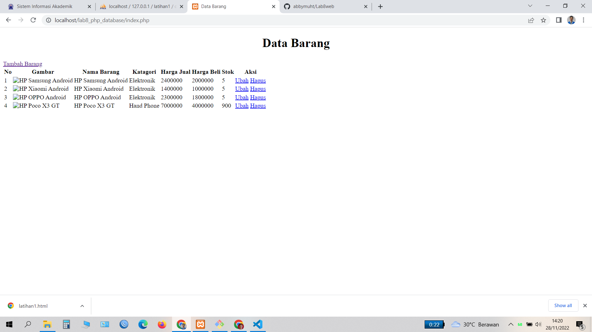
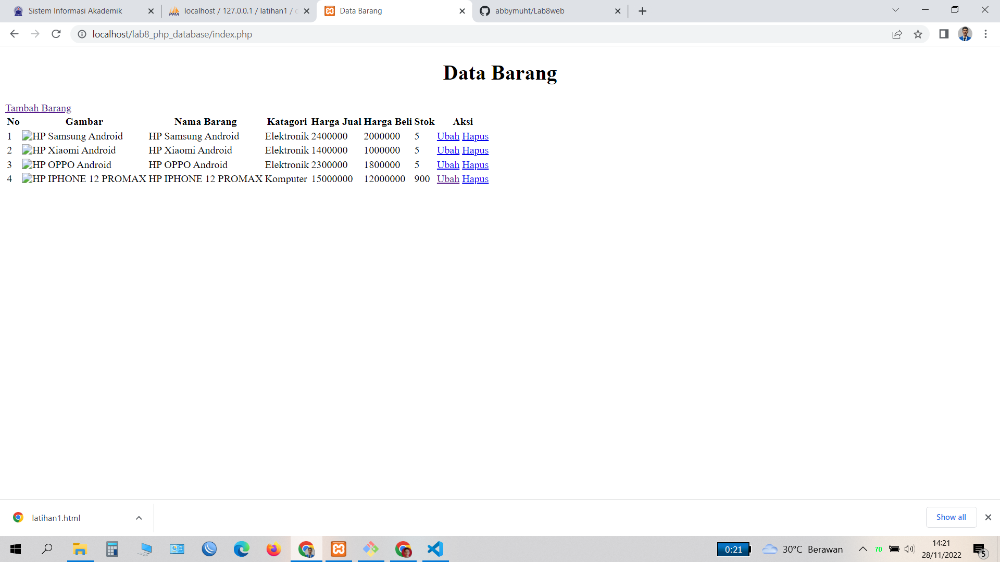
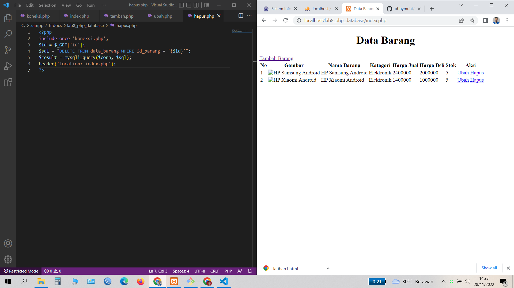

# Lab8web
# Nama      : Abby Muhammad Titan
# Nim       : 312110546
# Kelas     : TI.21.B.1
# UNIVERSITAS PELITA BANGSA

# Langkah 1
# Proses 1
# Menjalankan Web Server
# Untuk menjalankan web server dari menu XAMPP Control, kemudian klik start apache dan mysql

# Langkah 2
# Proses 2
# Mengakses Myphpadmin ini adalah link nya http://localhost/phpmyadmin/

# Langkah 3
# Membuat database dengan nama latihan

# Langkah 4
# Proses 4
# Variable PHP
# Membuat tabel pada database latihan 1 menggunakan syntax.
# CREATE TABLE data_barang (
#
# id_barang int(10) auto_increment Primary Key,
#
# kategori varchar(30),
#
# nama varchar(30),
#
# gambar varchar(100),
#
# harga_beli decimal(10,0),
#
# harga_jual decimal(10,0),
#
# stok int(4)
#
# );

# kemudian klik GO

# Langkah 5
# Proses 5
# Setalah itu tambahkan data pada tabel data_barang.
# Klik GO lagi

# Langkah 6
# Proses 6
# # Membuat program CRUD (Create, Read, Update, Delete) Buat folder lab8_php_database pada root directory web server (c:\xampp\htdocs)

# Langkah 7
# Proses 7
# Membuat file Read dengan ekstension php dan beri nama dengan index.php pada folder lab8_php_database, Simpan dan buka pada browser dengan link localhost/lab8_php_database/index.php

# Langkah 8
# Proses 8
# Membuat file tambah data (create) dengan ekstension php dan beri nama dengan tambah.php pada folder lab8_php_database. Simpan dan buka pada browser dengan klik tombol tambah barang atau dengan link localhost/lab8_php_database/tambah.php

# Langkah 9
# Proses 9
# Saya akan mencoba melakukan penambahan barang, sesuai keinginan kita jika sudah simpan dan lihat hasilnya.

# Langkah 10
# Proses 10
# Ini hasil nya, berhasil ya teman-teman penambahan barang nya :)

# Langkah 11
# Proses 11
# Membuat file ubah data (update) dengan ekstension php dan beri nama dengan ubah.php pada folder lab8_php_database. Simpan dan buka pada browser dengan klik tombol ubah atau dengan link localhost/lab8_php_database/ubah.php Disini saya melakukan perubahan data pada harga barang dan stok barang, kemudian simpan dan lihat hasilnya.
#
# dan berhasil juga ya teman-teman

# Langkah 12
# Proses 12
# Membuat file hapus data (delete) dengan ekstension php dan beri nama dengan hapus.php pada folder lab8_php_database. Simpan dan buka pada browser dengan klik tombol hapus atau dengan link localhost/lab8_php_database/hapus.php
# klik hapus, dan berhasil juga ya teman-teman :))

# Cukup sekian saya Abby Muhammad Titan
# Terimakasih, Semoga Bermanfaat.
# Wassalamualaikum Wr. Wb